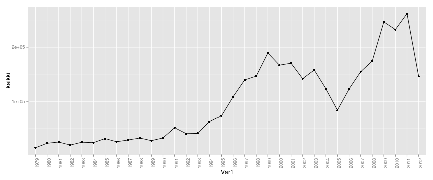
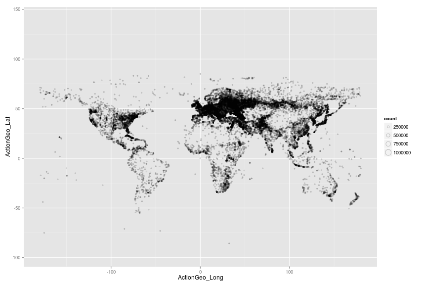
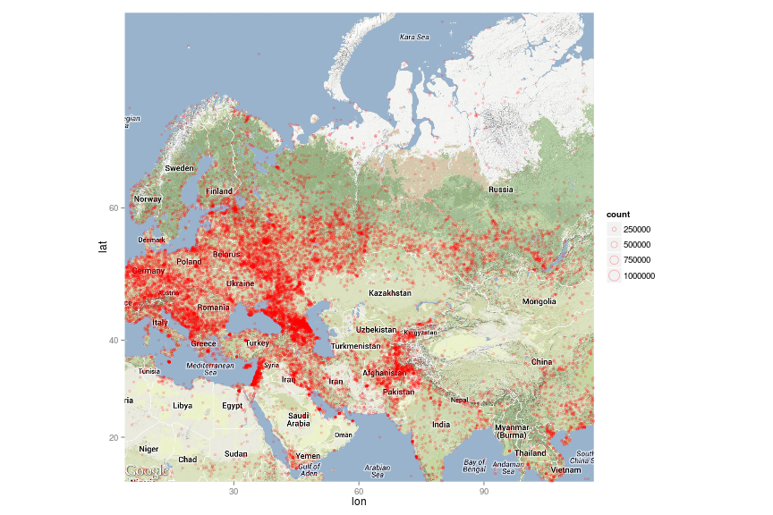
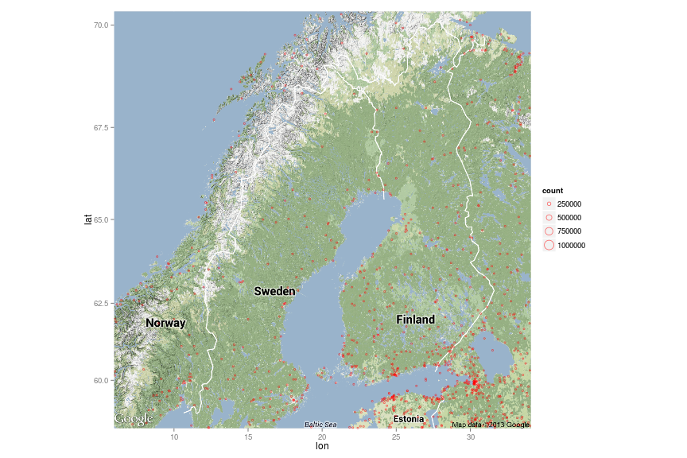
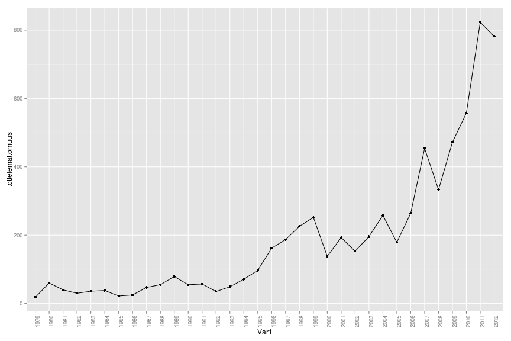
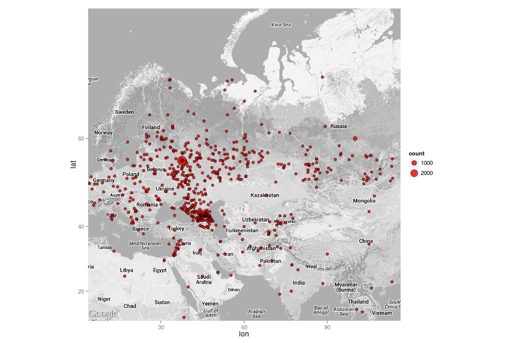
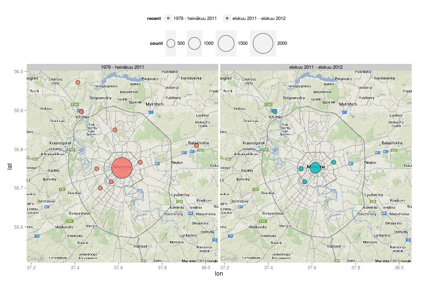
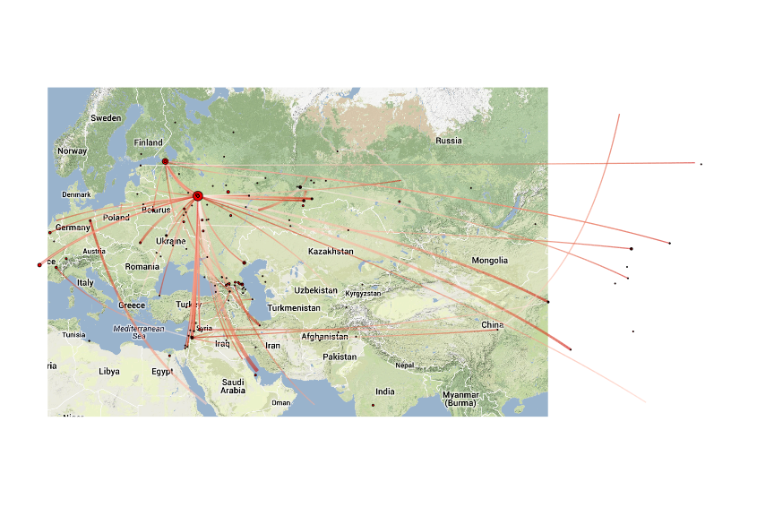

Avoin data Venäjän ja Itä-Euroopan tutkimuksessa: Tapaus GDELT-data
========================================================
author: maisterikoulun metodipaja 26.4.2013
date: Place, August 29, 2013
css: ../../template/rpresentation/slides.css

<strong><a href="http://markuskainu.fi">Markus Kainu</a></strong></br>
*PhD student* </br>
[Aleksanteri institute, University of Helsinki](http://helsinki.fi/aleksanteri) </br>
Finland </br>


Sisältö
========================================================

0. Oma tapa tutkia
1. Digitalisoituminen ja avoin data
2. Avoin data ja avoin tiede
3. Venäjän ja Itä-Euroopan tutkimus ja avoin data
4. GDELT-aineisto
5. Venäjään liittyvät tapahtumat GDELT-aineistossa
6. Kysymyksiä?

0. Oma tapa tutkia
========================================================
title: false
<h1 style="text-align:center;padding-top:200px;">0. Oma tapa tutkia</h1>

========================================================
- "lattea empirismi" yhteiskuntatieteissä
- **viitekehyksenä teoriat**: 
    1. oikeudenmukaisuudesta (filosofia)
    2. hyvinvointivaltion kehityksestä ja kannatusperustasta (sosiologia)
    3. tulonjaon vaikutuksista ihmisten taloudelliseen toimeliaisuuteen ((mikro)taloustiede)
- **aineistona** tilastot ja määrälliset kv-tutkimusaineistot kotitalouksien toimeentulosta ja elinoloista sekä arvoista ja asenteista
- **menetelminä** laskennalliset tilastolliset menetelmät

========================================================

>Pyrkimys kuvailla yleisiä asiantiloja yhteiskunnissa sekä niissä tapahtuvia muutoksia

- yleistettävyys
- muutos
- (kausaalisuus)

Aineistot ja menetelmät
========================================================
1. itse kerätyt aineistot
2. muiden keräämät aineistot
    - ei-tutkimusaineistot
    - tutkimusaineistot

>olemassaolevien aineistojen entistä parempi analysointi


1. Digitalisoituminen ja avoin data/tieto
========================================================
title: false
<h1 style="text-align:center;padding-top:200px;">1. Digitalisoituminen ja avoin data/tieto</h1>


========================================================
data > informaatio > tieto > (ratkaisut)

========================================================
- Avoimella tiedolla (open knowledge) viitataan digitaalisessa muodossa oleviin sisältöihin ja dataan, joita kuka tahansa voi vapaasti ja maksutta käyttää, muokata ja uudelleenjakaa. 
- Avoimen tiedon määritelmän[1] mukaisesti aineiston tulee olla **kokonaisuudessaan saatavilla käyttökelpoisessa ja muokattavassa muodossa Internetin kautta** ja **sen tulee olla lisensoitu niin, että sen käyttöä, muokkausta ja uudelleenjakelua ei rajoiteta.** - 
- Esimerkiksi Wikipedia -tietosanakirjan sisältö on avointa tietoa.
- Avoin tieto vaikuttaa esimerkiksi viestintään ja tieteenharjoittamiseen helpottamalla esimerkiksi toimittajien ja tutkijoiden tiedonhankintaa ja vähentämällä kuluja.

Avoin julkishallinnon data (Open Government data)
========================================================
- Julkishallinnon datan avaaminen on kansainvälinen, Yhdysvalloista ja Isosta-Britanniasta käynnistynyt ilmiö, joka on levinnyt nopeasti. 
- Avoin julkinen data on ajatusmalli, jossa julkissektorin, kansalaisten, verkkopalveluiden kehittäjien ja muiden datan käyttäjien vuorovaikutusta pyritään lisäämään sekä automatisoimaan yhteiskunnallisen hyvän lisäämiseksi.


2. Avoin data ja avoin tiede
========================================================
title: false
<h1 style="text-align:center;padding-top:200px;">2. Avoin data ja avoin tiede</h1>

Avoin tieteellinen tieto
========================================================
- Tieteellisen tiedon ja tutkimustulosten avoimen julkaisemisen kohdalla puhutaan niin sanotusta Open access -julkaisemisesta, jolla taataan, että tutkimustulokset julkaisut ja tausta-aineistot – ovat tiedeyhteisön ja kaikkien muidenkin vapaasti saatavissa.
- Yhä useampi tutkimusorganisaatio tai tutkimuksen rahoittaja asettaa omia suosituksiaan ja ehtojaan tutkimustulosten avoimesta saatavuudesta.

Avoin tiede
========================================================
- Avoin tiede (open science) on kattotermi liikkeelle, joka pyrkii edistämään avoimia toimintamalleja tieteellisessä tutkimuksessa. 
- Keskeinen tavoite on tutkimustulosten, tutkimusdatan ja tutkimuksessa käytettyjen menetelmien julkaiseminen avoimella lisenssillä siten, että ne ovat vapaasti kaikkien halukkaiden tarkasteltavissa sekä käytettävissä.

Avoin tiede sisältää käytäntöjä, kuten 
========================================================
- tutkimusjulkaisujen avoimen saatavuuden (ks. open access) edistäminen, 
- tutkimusaineistojen avoin julkaiseminen, 
- avoimen lähdekoodin ja avoimien standardien hyödyntäminen, sekä 
- tutkimusprosessin julkinen dokumentointi niin kutsutun avoimen muistikirjan menetelmällä.

Avoinen tieteen päähyödyt
========================================================
Resurssien jakamisen myötä tapahtuva:

- tieteen kehityksen nopeutuminen, 
- tutkimuskäytäntöjen läpinäkyvyyden lisääntymisestä johtuva laadun ja tutkimuksen toistettavuuden parantuminen, sekä 
- tutkimustulosten paremman saavutettavuuden myötä lisääntyvä yhteiskunnallinen vaikuttavuus. 
- Tutkimusaineistojen vapaa jakaminen saattaa myös lisätä viittauksia tehtyyn tutkimustyöhön


3. Avoin data ja Venäjän ja Itä-Euroopan tutkimus
========================================================
title: false
<h1 style="text-align:center;padding-top:200px;">3. Avoin data ja Venäjän ja Itä-Euroopan tutkimus</h1>

Avoimia dataportaaleja
========================================================
- [OpenGovData Russia Catalog](http://opengovdata.ru/) Launched in 2010, private initiative.
- [data.mos.ru](http://data.mos.ru/)
- [rosspending.ru](http://rosspending.ru/)
- [democrator.ru/](http://democrator.ru/)
- [taktaktak.org/](http://taktaktak.org/)
- [Ulyanovsk Oblast: Regional Government Launches Open Data Initiative in Russia](http://www.worldbank.org/en/news/press-release/2013/04/10/ulyanovsk-oblast-regional-government-launches-open-data-initiative-in-russia)

- [Estonian government open-data website](http://www.opendata.ee/)
- [Moldovan government open-data website.](http://date.gov.md/)

- [European Commission Data Portal](http://open-data.europa.eu)
- [The United Nations](http://data.un.org)


4. GDELT-aineisto
========================================================
title: false
<h1 style="text-align:center;padding-top:200px;">4. GDELT-aineisto</h1>

========================================================
- GDELT is a new CAMEO-coded data set containing more than 200-million geolocated events with global coverage for 1979 to the present.
- Julkaistu avoimesti maaliskuussa 2013
- The primary author is Kalev Leetaru at the University of Illinois Graduate School of Library and Information Science. 
- The data are based on a variety of international news sources coded using the [TABARI system](http://eventdata.psu.edu/tabari.dir/tabari.manual.0.8.4b1.pdf) for events and additional software for location and tone; the data will be updated daily. 
- [http://eventdata.psu.edu/data.dir/GDELT.html](http://eventdata.psu.edu/data.dir/GDELT.html)

========================================================
>I suspect this is going to be the data set that launches a thousand dissertations." 

Jay Ulfelder, a Poli Sci researcher, [The Future of Political Science Just Showed Up](http://dartthrowingchimp.wordpress.com/2013/04/10/the-future-of-political-science-just-showed-up/)

Muita Linkkejä
========================================================
- [Kalev Leetaru & Philip A. Schrodt (2013) GDELT: Global Data on Events, Location and Tone, 1979-2012](http://eventdata.psu.edu/papers.dir/ISA.2013.GDELT.pdf) - Paper presented at the International Studies Association meetings, San Francisco, April 2013.  
- [GDELT: Global Data on Events, Location and Tone, 1979-2012](http://asecondmouse.wordpress.com/2013/04/15/gdelt-global-data-on-events-location-and-tone-1979-2012/)
- [GDELT: a big data history of life, the universe and everything](http://www.guardian.co.uk/news/datablog/2013/apr/12/gdelt-global-database-events-location) - Guardian

5. Venäjään liittyvät tapahtumat GDELT-aineistossa
========================================================
title: false
<h1 style="text-align:center;padding-top:200px;">5. Venäjään liittyvät tapahtumat GDELT-aineistossa</h1>

Pohjautuu [Rolf Fredheimin blogipostiin maaliskuulta 2013](http://quantifyingmemory.blogspot.fi/2013/04/mapping-gdelt-data-in-r-and-some.html)


Valmistelua
========================================================
- ladataan aineisto [GDELT:in sivuilta](http://eventdata.psu.edu/data.dir/GDELT.html) ja puretaan se. Kokonaisuudessaan ~4.6GT vuosittain koostettuja tekstitaulukkoja
- Ohjeita datan manipuloimiseen esim. [Getting Started with GDELT by David Masad](http://nbviewer.ipython.org/urls/raw.github.com/dmasad/GDELT_Intro/master/Getting_Started_with_GDELT.ipynb) ja []()

Datan analysointia
========================================================
- Käytetään [python](http://www.python.org/) - ja [R](http://www.r-project.org/)-kieliä
- pythonilla valitaan massivisesta datasta Venäjää koskevat tapahtumat ja analysit kirjoitetaan R:llä

Venäjää koskeva data
========================================================

```
'data.frame':	3338751 obs. of  12 variables:
 $ Day           : POSIXct, format: "1979-01-01" "1979-01-01" ...
 $ Actor1Code    : Factor w/ 4569 levels "AAR","ABK","ABR010",..: 212 2936 2936 2936 3621 3621 3621 3621 3621 3646 ...
 $ Actor2Code    : Factor w/ 4635 levels "AAR","ABK","ABR010",..: 3660 3660 3660 3660 1573 2002 2960 2960 4441 1570 ...
 $ EventCode     : int  120 40 43 51 841 100 40 42 40 71 ...
 $ QuadCategory  : int  3 2 2 2 1 3 2 2 2 1 ...
 $ GoldsteinScale: num  -4 1 2.8 3.4 7 -5 1 1.9 1 7.4 ...
 $ Actor1Geo_Lat : num  52.1 55.8 52.1 55.8 6.8 ...
 $ Actor1Geo_Long: num  140.4 37.6 140.4 37.6 -58.1 ...
 $ Actor2Geo_Lat : num  52.1 55.8 52.1 55.8 38 ...
 $ Actor2Geo_Long: num  140.4 37.6 140.4 37.6 -97 ...
 $ ActionGeo_Lat : num  52.1 55.8 52.1 55.8 6.8 ...
 $ ActionGeo_Long: num  140.4 37.6 140.4 37.6 -58.1 ...
```


ActorCode & EventCode
========================================================
- [CAMEO - Conflict and Mediation Event Observations](http://web.ku.edu/~keds/cameo.dir/CAMEO.CDB.09b5.pdf)
- [Commonly Used CAMEO Agents](http://eventdata.psu.edu/cameo.dir/Agents.summary.pdf)

QuadCategory
========================================================
1. Material Cooperation
2. Verbal Cooperation
3. Verbal Conflict
4. Material Conflict

GoldsteinScale
========================================================
- [Goldstein, Joshua S. 1992. “A Conflict-Cooperation Scale for WEIS Events Data.” Journal of Conflict Resolution 36 (2)](http://jcr.sagepub.com/content/36/2/369.short)
- [ Goldstein Scale for WEIS Data](http://www.chsbs.cmich.edu/fattah/courses/empirical/jgscale.htm)


6 ensimmäistä tapahtumaa
========================================================

```
         Day Actor1Code Actor2Code EventCode QuadCategory GoldsteinScale
1 1979-01-01        ATH        RUS       120            3           -4.0
2 1979-01-01        MOS        RUS        40            2            1.0
3 1979-01-01        MOS        RUS        43            2            2.8
4 1979-01-01        MOS        RUS        51            2            3.4
5 1979-01-01        RUS     GUYGOV       841            1            7.0
6 1979-01-01        RUS        IRN       100            3           -5.0
  Actor1Geo_Lat Actor1Geo_Long Actor2Geo_Lat Actor2Geo_Long ActionGeo_Lat
1         52.13         140.38         52.13         140.38         52.13
2         55.75          37.62         55.75          37.62         55.75
3         52.13         140.38         52.13         140.38         52.13
4         55.75          37.62         55.75          37.62         55.75
5          6.80         -58.15         38.00         -97.00          6.80
6         55.75          37.62         55.75          37.62         55.75
  ActionGeo_Long
1         140.38
2          37.62
3         140.38
4          37.62
5         -58.15
6          37.62
```


Keskeisimmät toimijat
========================================================

```

    IRN     CVL     DEU     JPN     CHE  USAGOV     GBR     BUS     LEG 
  21413   21801   22956   24430   25539   25544   25775   28223   31419 
    COP     CHN     UKR  RUSMED  RUSMIL     MIL     MED     USA     GOV 
  31773   35332   35857   35904   36555   40957   50677   89275  128319 
 RUSGOV     RUS 
 283648 1422931 
```


Tapahtumien vuosittaiset määrät
========================================================
 


========================================================
 


========================================================

 


========================================================

 


Valitaan kansalaistottelemattomuutta sisältäneet tapahtumat
========================================================
- protests, 
- rallies, 
- hunger strikes, 
- strikes, 
- boycotts, 
- obstructions, 
- violent protest


========================================================

 


========================================================

 


Moskova
========================================================

 


========================================================

 


Russia's links to the World: 1979-2012
========================================================
- [video](http://www.youtube.com/embed/foQvgbo7lOw)
- [big geo-data visualisations](http://quantifyingmemory.blogspot.fi/2013/04/big-geo-data-visualisations.html)


6. Kysymyksiä
========================================================
title: false
<h1 style="text-align:center;padding-top:200px;">6. Kysymyksiä</h1>

<center>

</center>


Kiitos!
========================================================
title: false
<h1 style="text-align:center;padding-top:200px;">Kiitos!</h1>
